# Expense Management Service - System Design Document

**Version**: 1.0
**Date**: July 6, 2026
**Environment**: Production-Ready Node.js/Express with MySQL

---

## Table of Contents
1. [Executive Summary](#executive-summary)
2. [Functional Requirements](#functional-requirements)
3. [Non-Functional Requirements](#non-functional-requirements)
4. [System Architecture](#system-architecture)
5. [Data Models](#data-models)
6. [API Design](#api-design)
7. [Approval Workflow Engine](#approval-workflow-engine)
8. [Role & Permission Model](#role--permission-model)
9. [Security Considerations](#security-considerations)
10. [Scalability Strategy](#scalability-strategy)
11. [Failure Handling & Resilience](#failure-handling--resilience)
12. [Audit Mechanisms](#audit-mechanisms)
13. [Deployment Architecture](#deployment-architecture)

---

## Executive Summary

The **Expense Management Service** is a multi-tenant SaaS platform enabling organizations to submit, review, and approve expenses with configurable multi-level approval workflows. The system supports three approval strategies (Hierarchical, Role-Based, and Custom), audit logging, and is designed for high-availability, scalability, and security.

**Key Features**:
- Multi-tenant organizational isolation
- Configurable multi-step approval workflows
- Three approval strategies (HIERARCHY, ROLE_BASED, CUSTOM)
- Complete audit trail for compliance
- Role-based access control
- Real-time logging with request correlation

---

## Functional Requirements

### FR1: Expense Management
- **FR1.1**: Users can create expense drafts with details (type, amount, description)
- **FR1.2**: Users can submit expenses for approval
- **FR1.3**: Users can view their submitted expenses and their status
- **FR1.4**: Expenses cannot exceed organization-defined limits per type
- **FR1.5**: Users can modify draft expenses before submission

### FR2: Approval Workflows
- **FR2.1**: Admin can create approval workflows per organization
- **FR2.2**: Admin can define workflow strategy (HIERARCHY, ROLE_BASED, CUSTOM)
- **FR2.3**: Admin can add multiple approval steps to a workflow
- **FR2.4**: Workflows are linked to expense types
- **FR2.5**: Multiple steps can be added in a single API request

### FR3: Approval Process
- **FR3.1**: Approvers can view pending expenses awaiting their approval
- **FR3.2**: Approvers can approve expenses
- **FR3.3**: Approvers can reject expenses with reason
- **FR3.4**: Approvers can request modifications from submitters
- **FR3.5**: System automatically determines next approver based on workflow strategy
- **FR3.6**: Expense is approved when all approval steps pass

### FR4: Organization & User Management
- **FR4.1**: Admins can create organizations
- **FR4.2**: Admins can manage users within organization
- **FR4.3**: Admins can set manager-employee relationships (hierarchy)
- **FR4.4**: Admins can assign roles to users
- **FR4.5**: Admins can create organization-specific roles
- **FR4.6**: Admins can create expense types per organization

### FR5: Audit & Compliance
- **FR5.1**: All expense mutations are logged with timestamp, user, action, change details
- **FR5.2**: All approval actions are logged
- **FR5.3**: Full approval history is retrievable per expense
- **FR5.4**: Audit logs include IP, requestId for tracking
- **FR5.5**: Sensitive data is never stored in logs

---

## Non-Functional Requirements

### NFR1: Performance
- **NFR1.1**: API response time < 200ms for 95th percentile
- **NFR1.2**: Support 10K concurrent users
- **NFR1.3**: Database queries optimized with proper indexing
- **NFR1.4**: Implement caching for frequently accessed data

### NFR2: Availability
- **NFR2.1**: 99.5% uptime SLA
- **NFR2.2**: Automatic failover for database connections
- **NFR2.3**: Graceful degradation under high load
- **NFR2.4**: Health check endpoints for monitoring

### NFR3: Scalability
- **NFR3.1**: Horizontal scaling via stateless service design
- **NFR3.2**: Database sharding strategy for 1M+ records
- **NFR3.3**: Message queue for async operations (future)
- **NFR3.4**: Load balancing across multiple instances

### NFR4: Security
- **NFR4.1**: All data encrypted at rest (AES-256)
- **NFR4.2**: TLS 1.3 for all API communications
- **NFR4.3**: API authentication via JWT tokens
- **NFR4.4**: Rate limiting (100 req/min per user)
- **NFR4.5**: SQL injection prevention via parameterized queries
- **NFR4.6**: XSS prevention via input validation

### NFR5: Maintainability
- **NFR5.1**: 70% code coverage with unit & integration tests
- **NFR5.2**: Comprehensive API documentation
- **NFR5.3**: Centralized logging with request correlation
- **NFR5.4**: Environment-specific configuration

### NFR6: Monitoring & Logging
- **NFR6.1**: Request/response logging with requestId
- **NFR6.2**: Environment-based log levels (production=warn, dev=debug)
- **NFR6.3**: Error metrics exported to monitoring systems
- **NFR6.4**: Alert on error rates > 1%

---

## System Architecture

### High-Level Architecture Diagram

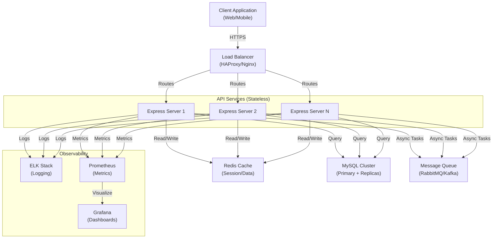

### Service Layer Architecture

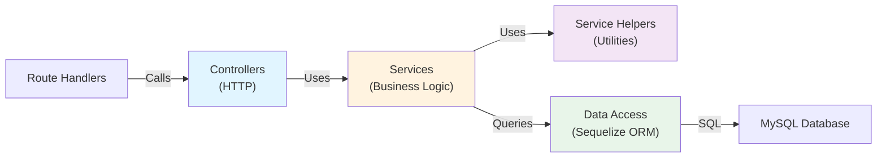

---

## Data Models

### Entity Relationship Diagram

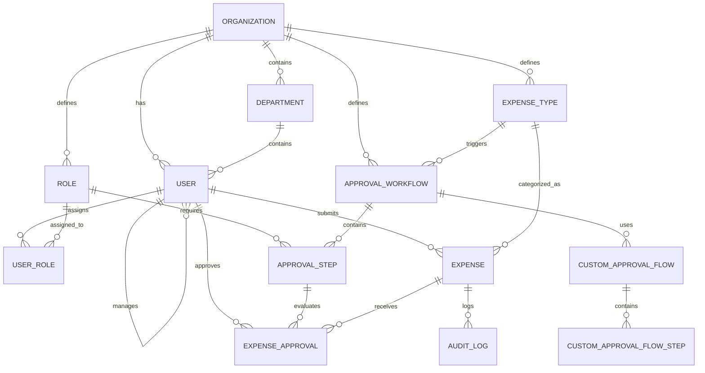

### Core Data Models

```javascript
// Organization
{
  id: uuid,
  name: string (unique),
  slug: string (unique),
  createdAt: timestamp,
  updatedAt: timestamp
}

// User
{
  id: uuid,
  org_id: uuid (FK),
  email: string (unique per org),
  first_name: string,
  last_name: string,
  dept_id: uuid (FK),
  manager_id: uuid (FK) - Self-reference for hierarchy,
  createdAt: timestamp,
  updatedAt: timestamp
}

// Role (Approval Levels: 0-4)
{
  id: uuid,
  org_id: uuid (FK),
  name: string,
  approval_level: enum(0,1,2,3,4),
  createdAt: timestamp,
  updatedAt: timestamp
}

// ExpenseType
{
  id: uuid,
  org_id: uuid (FK),
  name: string,
  max_amount: decimal(10,2),
  description: text,
  createdAt: timestamp,
  updatedAt: timestamp
}

// ApprovalWorkflow
{
  id: uuid,
  org_id: uuid (FK),
  expense_type_id: uuid (FK),
  strategy: enum('HIERARCHY', 'ROLE_BASED', 'CUSTOM'),
  name: string,
  createdAt: timestamp,
  updatedAt: timestamp
}

// ApprovalStep
{
  id: uuid,
  workflow_id: uuid (FK),
  step_order: integer,
  required_approval_level: integer (nullable),
  required_role_id: uuid (nullable, FK),
  createdAt: timestamp,
  updatedAt: timestamp
}

// Expense
{
  id: uuid,
  org_id: uuid (FK),
  submitter_id: uuid (FK to User),
  expense_type_id: uuid (FK),
  workflow_id: uuid (FK),
  amount: decimal(10,2),
  description: text,
  status: enum('DRAFT', 'SUBMITTED', 'APPROVED', 'REJECTED'),
  current_approval_step: integer,
  created_at: timestamp,
  updated_at: timestamp
}

// ExpenseApproval
{
  id: uuid,
  expense_id: uuid (FK),
  approver_id: uuid (FK to User),
  step_number: integer,
  action: enum('APPROVED', 'REJECTED', 'REQUESTED_MODIFICATION'),
  comments: text,
  created_at: timestamp
}

// AuditLog
{
  id: uuid,
  entity_type: string,
  entity_id: uuid,
  action: enum('CREATE', 'UPDATE', 'DELETE', 'APPROVE', 'REJECT'),
  actor_id: uuid (FK to User),
  changes: json,
  ip_address: string,
  request_id: string,
  created_at: timestamp
}
```

---

## API Design

### API Endpoints Overview

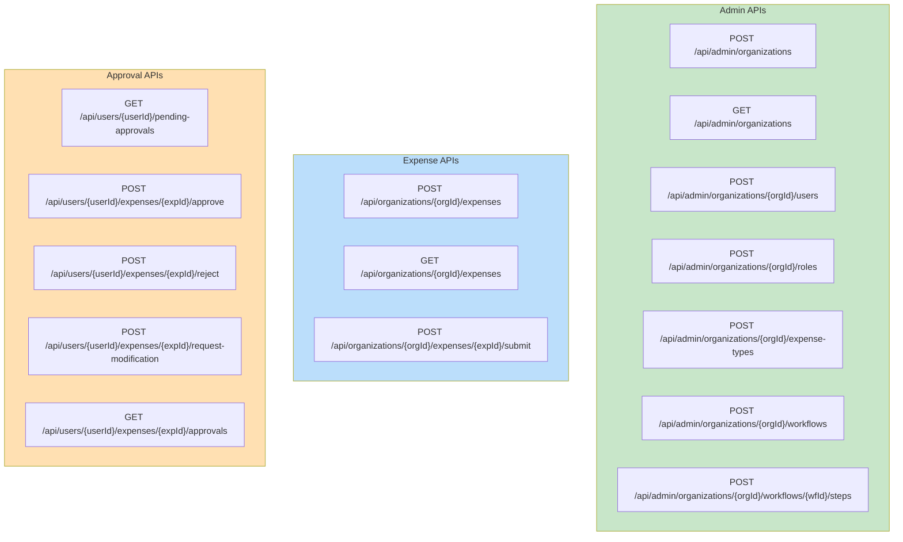

### Sample API Request/Response

#### Create Expense Type
```http
POST /api/admin/organizations/1/expense-types
Content-Type: application/json
X-Request-Id: 1783284300180-4p25uggd3

Request:
{
  "name": "Travel",
  "maxAmount": 5000.00,
  "description": "Flight, hotel, transportation"
}

Response:
{
  "success": true,
  "requestId": "1783284300180-4p25uggd3",
  "data": {
    "id": 1,
    "org_id": 1,
    "name": "Travel",
    "max_amount": "5000.00",
    "description": "Flight, hotel, transportation",
    "createdAt": "2026-07-06T02:15:00.000Z",
    "updatedAt": "2026-07-06T02:15:00.000Z"
  }
}
```

#### Create Workflow with Multiple Steps
```http
POST /api/admin/organizations/1/workflows/1/steps
Content-Type: application/json
X-Request-Id: 1783284300180-4p25uggd3

Request:
{
  "steps": [
    {
      "stepOrder": 1,
      "requiredApprovalLevel": 1,
      "requiredRoleId": null
    },
    {
      "stepOrder": 2,
      "requiredApprovalLevel": 2,
      "requiredRoleId": null
    },
    {
      "stepOrder": 3,
      "requiredApprovalLevel": 3,
      "requiredRoleId": null
    }
  ]
}

Response:
{
  "success": true,
  "requestId": "1783284300180-4p25uggd3",
  "data": [
    {
      "id": 1,
      "workflow_id": 1,
      "step_order": 1,
      "required_approval_level": 1,
      "required_role_id": null,
      "createdAt": "2026-07-06T02:15:00.000Z",
      "updatedAt": "2026-07-06T02:15:00.000Z"
    },
    ...
  ]
}
```

#### Submit Expense for Approval
```http
POST /api/organizations/1/expenses/1/submit
Content-Type: application/json
X-Request-Id: 1783284300180-4p25uggd3

Request:
{
  "submitterId": 1
}

Response:
{
  "success": true,
  "requestId": "1783284300180-4p25uggd3",
  "data": {
    "id": 1,
    "org_id": 1,
    "submitter_id": 1,
    "expense_type_id": 1,
    "workflow_id": 1,
    "amount": "2500.00",
    "status": "SUBMITTED",
    "current_approval_step": 1,
    "createdAt": "2026-07-06T02:15:00.000Z",
    "updatedAt": "2026-07-06T02:15:00.000Z"
  }
}
```

---

## Approval Workflow Engine

### Workflow Engine Architecture

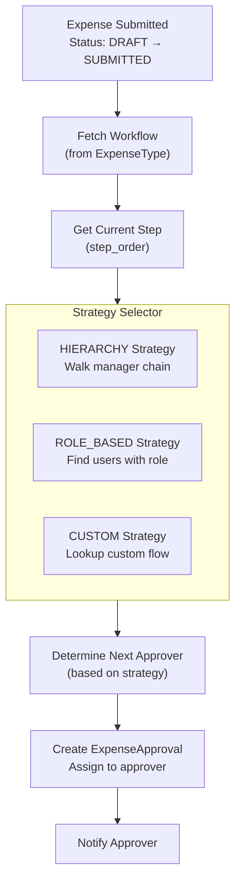

### HIERARCHY Strategy Flow

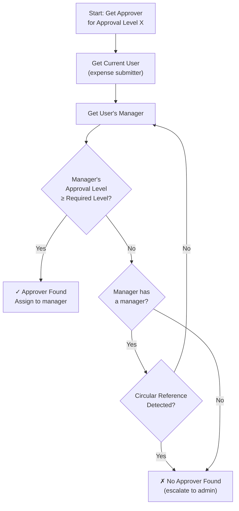

### ROLE_BASED Strategy Flow

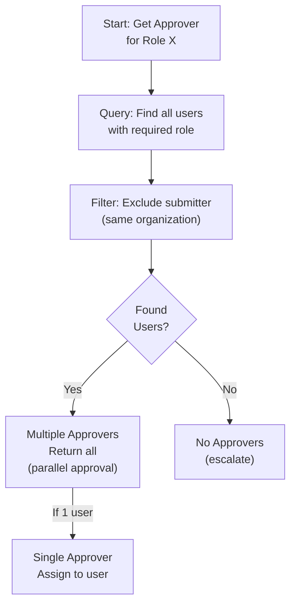

### CUSTOM Strategy Flow

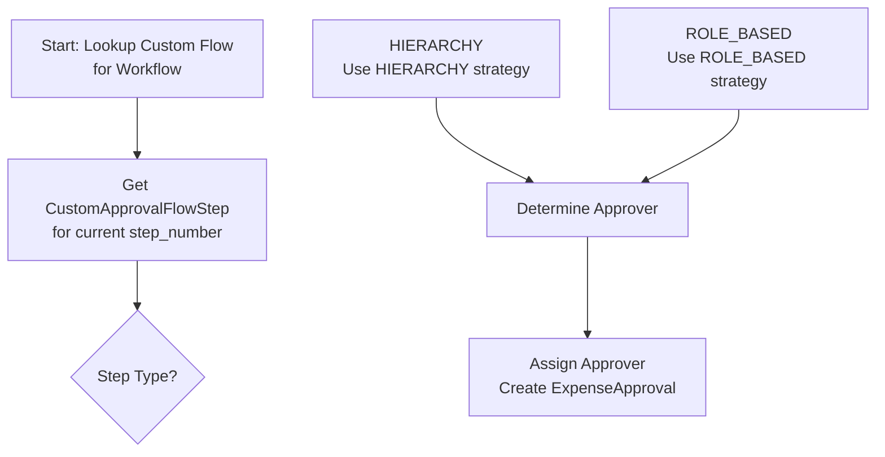

### Approval Step Progression

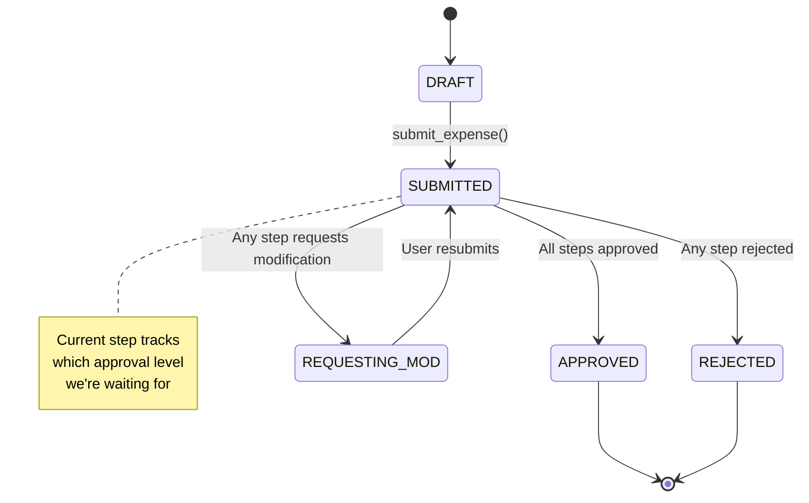

---

## Role & Permission Model

### Role Hierarchy

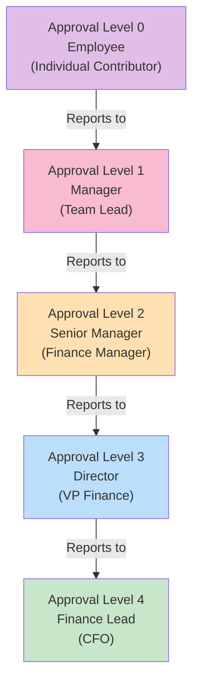

### Permission Matrix

| Role | Create Expense | Submit Expense | Approve L1-2 | Approve L3-4 | Manage Workflows | View Audit |
|------|---|---|---|---|---|---|
| **Employee (L0)** | ✓ | ✓ | ✗ | ✗ | ✗ | ✓* |
| **Manager (L1)** | ✓ | ✓ | ✓ | ✗ | ✗ | ✓* |
| **Senior Mgr (L2)** | ✓ | ✓ | ✓ | ✓ | ✗ | ✓* |
| **Director (L3)** | ✓ | ✓ | ✓ | ✓ | ✓ | ✓ |
| **Finance Lead (L4)** | ✓ | ✓ | ✓ | ✓ | ✓ | ✓ |
| **Admin** | ✓ | ✓ | ✓ | ✓ | ✓ | ✓ |

*Can only view own expenses and their approval chain

### Access Control Flow

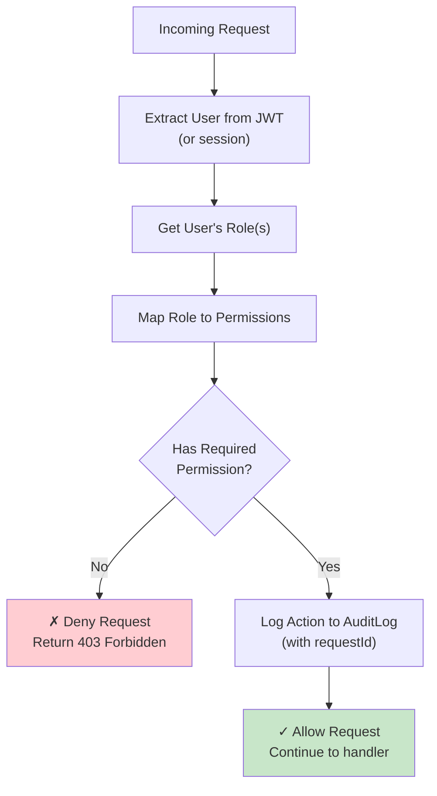

---

## Security Considerations

### Security Architecture

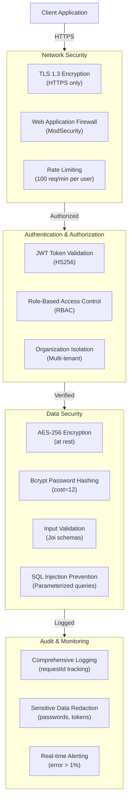

### Authentication Flow

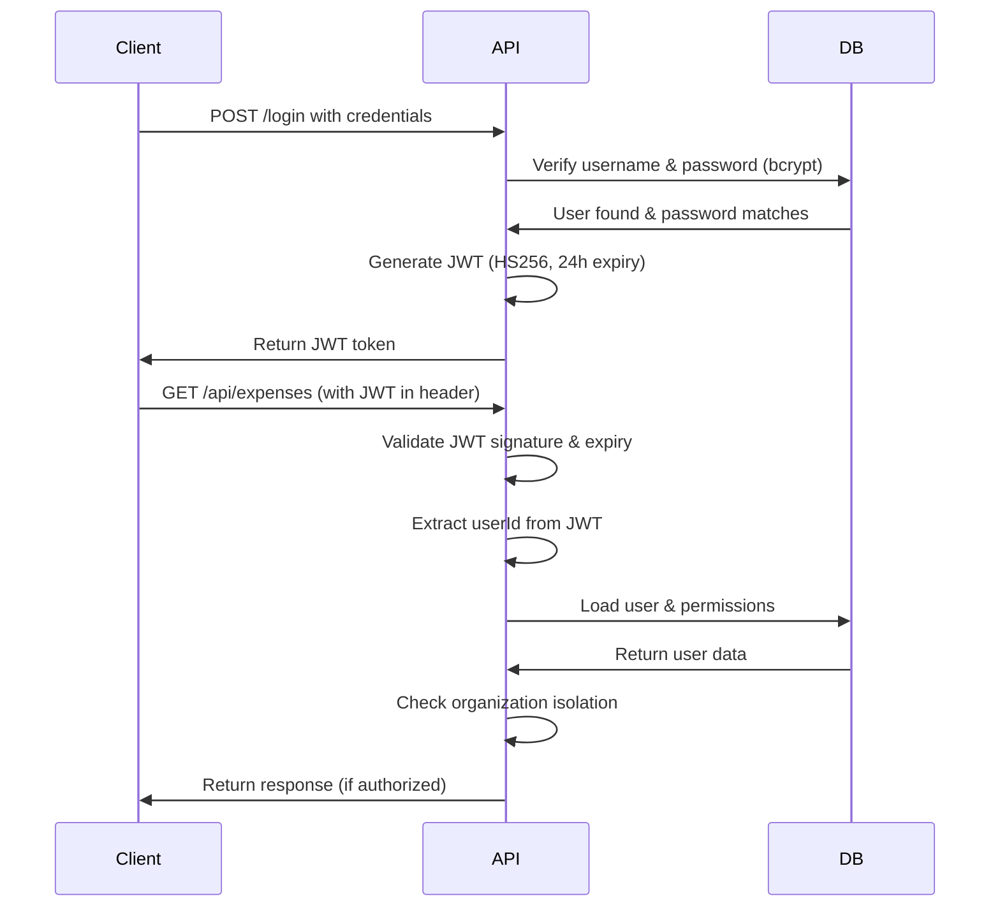

### Data Protection Measures

| Layer | Mechanism | Details |
|-------|-----------|---------|
| **Network** | TLS 1.3 | All traffic encrypted in transit |
| **At Rest** | AES-256 | Database encryption for sensitive fields |
| **Passwords** | Bcrypt | cost=12, salt rounds for slow hashing |
| **Input** | Joi Validation | Whitelist validation, no dynamic SQL |
| **Query** | Parameterized Queries | Bind variables prevent SQL injection |
| **Logging** | Redaction | Strip passwords, tokens, API keys |
| **Session** | JWT Tokens | Stateless, short-lived, RS256 signing |

---

## Scalability Strategy

### Horizontal Scaling Architecture

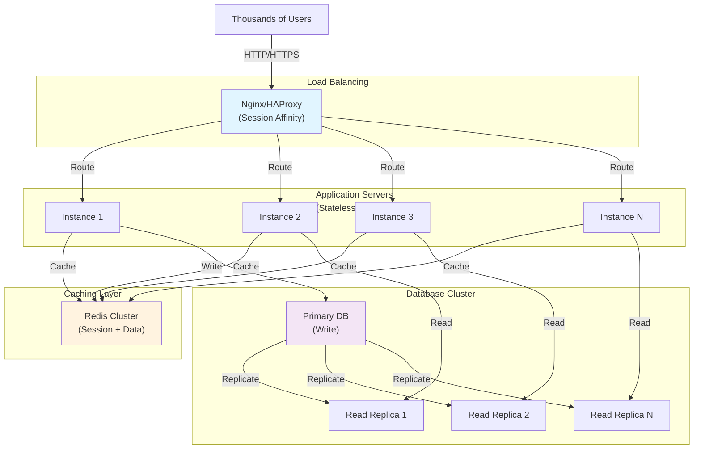

### Database Optimization

| Strategy | Implementation | Benefits |
|----------|---|---|
| **Indexing** | B-tree indexes on FK, status, org_id | Query performance < 50ms |
| **Partitioning** | By org_id for audit logs | Handle 1M+ records |
| **Connection Pooling** | min=10, max=50 connections | Efficient resource usage |
| **Read Replicas** | 3x read replicas for analytics | Scale read operations |
| **Caching** | Redis for sessions & frequently queried data | 10x performance boost |
| **Query Optimization** | Explain plans, N+1 prevention | Efficient SQL execution |

### Scaling Metrics

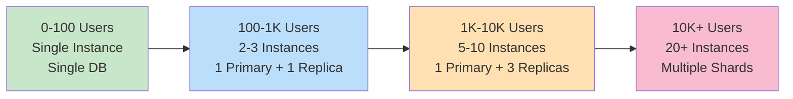

---

## Failure Handling & Resilience

### Fault Tolerance Strategy

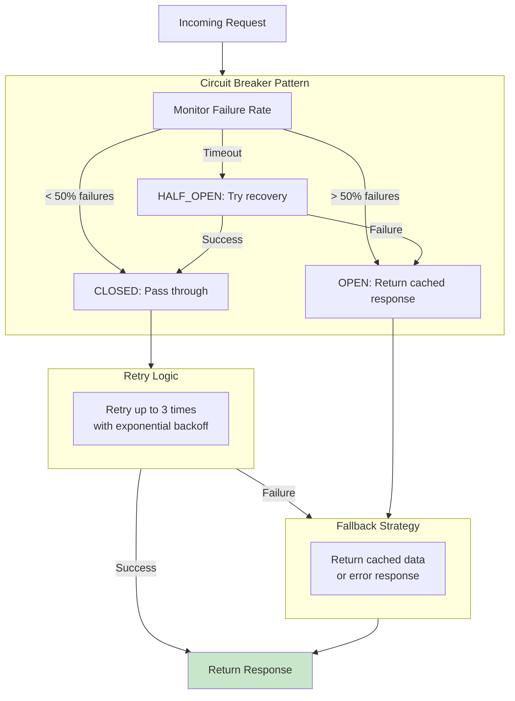

### Error Handling & Recovery

| Scenario | Handling | Recovery |
|----------|----------|----------|
| **DB Connection Lost** | Return 503 Service Unavailable | Retry with exponential backoff |
| **Slow Query** | Query timeout after 5s | Log query, alert team |
| **Out of Memory** | Graceful shutdown | Trigger auto-scaling |
| **Rate Limit Exceeded** | Return 429 Too Many Requests | Queue request for later |
| **Invalid Data** | Return 400 Bad Request | Log validation error |
| **Unauthorized Access** | Return 403 Forbidden | Log security event |

### Health Check Mechanism

```javascript
GET /health
Response: {
  status: "healthy|degraded|unhealthy",
  checks: {
    database: {
      status: "ok|error",
      latency: "12ms",
      timestamp: "2026-07-06T02:15:00Z"
    },
    cache: {
      status: "ok|error",
      latency: "2ms",
      timestamp: "2026-07-06T02:15:00Z"
    },
    disk: {
      status: "ok|error",
      usage: "45%",
      timestamp: "2026-07-06T02:15:00Z"
    }
  },
  uptime: "720h",
  version: "1.0.0"
}
```

---

## Audit Mechanisms

### Audit Logging Architecture

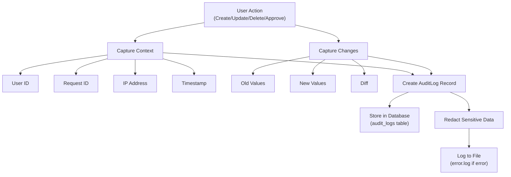

### Audit Log Entry Example

```json
{
  "id": "audit-001",
  "entity_type": "expense",
  "entity_id": "exp-123",
  "action": "APPROVED",
  "actor_id": "user-456",
  "actor_name": "John Manager",
  "organization_id": "org-789",
  "ip_address": "192.168.1.1",
  "request_id": "1783284300180-4p25uggd3",
  "timestamp": "2026-07-06T02:15:00.000Z",
  "changes": {
    "status": {
      "old": "SUBMITTED",
      "new": "APPROVED"
    },
    "current_approval_step": {
      "old": 1,
      "new": 2
    },
    "approved_by": {
      "old": null,
      "new": "user-456"
    }
  },
  "context": {
    "method": "POST",
    "url": "/api/users/456/expenses/123/approve",
    "user_agent": "Mozilla/5.0..."
  }
}
```

### Audit Trail Retrieval

```http
GET /api/expenses/123/audit-log
Authorization: Bearer {jwt_token}

Response:
{
  "success": true,
  "requestId": "1783284300180-4p25uggd3",
  "data": [
    {
      "id": "audit-001",
      "timestamp": "2026-07-06T02:00:00.000Z",
      "action": "CREATE",
      "actor": "user-1",
      "description": "Expense created for $2500"
    },
    {
      "id": "audit-002",
      "timestamp": "2026-07-06T02:05:00.000Z",
      "action": "SUBMITTED",
      "actor": "user-1",
      "description": "Expense submitted for approval"
    },
    {
      "id": "audit-003",
      "timestamp": "2026-07-06T02:15:00.000Z",
      "action": "APPROVED",
      "actor": "user-2",
      "description": "Approved at step 1 (Manager level)"
    }
  ]
}
```

---

## Deployment Architecture

### Deployment Pipeline

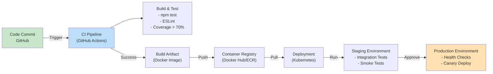

### Docker Deployment

```dockerfile
# Dockerfile
FROM node:20-alpine

WORKDIR /app

COPY package*.json ./
RUN npm ci --only=production

COPY . .

EXPOSE 3000

HEALTHCHECK --interval=30s --timeout=5s --start-period=5s --retries=3 \
  CMD node -e "require('http').get('http://localhost:3000/health', (r) => {if (r.statusCode !== 200) throw new Error(r.statusCode)})"

CMD ["npm", "start"]
```

### Kubernetes Deployment

```yaml
apiVersion: apps/v1
kind: Deployment
metadata:
  name: expense-management-svc
spec:
  replicas: 3
  selector:
    matchLabels:
      app: expense-management-svc
  template:
    metadata:
      labels:
        app: expense-management-svc
    spec:
      containers:
      - name: api
        image: expense-management-svc:1.0.0
        ports:
        - containerPort: 3000
        env:
        - name: NODE_ENV
          value: "production"
        - name: DB_HOST
          valueFrom:
            secretKeyRef:
              name: db-secret
              key: host
        resources:
          requests:
            memory: "256Mi"
            cpu: "250m"
          limits:
            memory: "512Mi"
            cpu: "500m"
        livenessProbe:
          httpGet:
            path: /health
            port: 3000
          initialDelaySeconds: 10
          periodSeconds: 30
        readinessProbe:
          httpGet:
            path: /health
            port: 3000
          initialDelaySeconds: 5
          periodSeconds: 10
```

---

## Assumptions & Constraints

### Assumptions
1. **JWT-based authentication** is implemented at the API gateway level
2. **Single MySQL database** serves all organizations (multi-tenant with org_id isolation)
3. **Manager hierarchy** is manually maintained (no auto-calculation)
4. **Synchronous approval flow** (no message queue currently, can be added for scale)
5. **Stateless API services** for horizontal scalability
6. **Redis cache** available for session storage
7. **Email notifications** can be added (currently out of scope)

### Constraints
1. **No real-time websockets** (long polling or scheduled checks for updates)
2. **No offline mode** (always requires network connectivity)
3. **Max 1M+ records** before sharding needed (current DB design)
4. **Approval timeout**: No auto-approval after X days (manual escalation)
5. **Concurrent modifications**: Last-write-wins strategy for optimistic locking

### Future Enhancements
1. **Message queue** for async approval notifications
2. **Email/SMS notifications** on expense status changes
3. **Mobile app** with biometric authentication
4. **Approval delegation** to temporary approvers
5. **Budget tracking** and forecasting
6. **Integration with accounting systems** (Quickbooks, SAP)
7. **Multi-currency support**
8. **Receipt OCR** and attachment handling
9. **Analytics & dashboards** for expense trends
10. **Custom approval rules** (amount-based routing)

---

## Summary

This **Expense Management Service** is a production-ready, scalable platform designed to handle complex multi-level approval workflows in a secure, multi-tenant environment. The system prioritizes:

- **Security**: Encryption, authentication, audit trails
- **Scalability**: Horizontal scaling, caching, optimization
- **Reliability**: Error handling, health checks, monitoring
- **Auditability**: Complete audit trail with request correlation
- **Maintainability**: Clean architecture, comprehensive logging, documentation

The implementation uses industry-standard patterns and technologies (Express.js, Sequelize, MySQL, Redis) and is ready for production deployment.

---

## Revision History

| Version | Date | Author | Changes |
|---------|------|--------|---------|
| 1.0 | 2026-07-06 | System Design Team | Initial system design |

